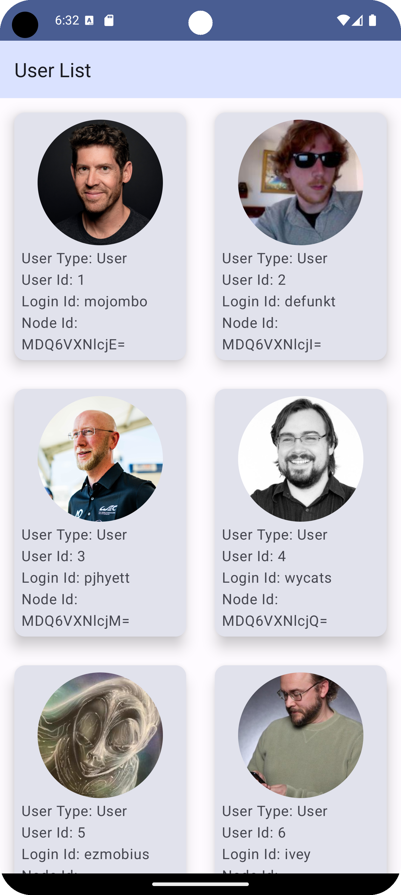

# Design and implement an Android application which should have the following 2 screens.

## Screen1 – List of GitHub Users Screen
- This screen should be the first screen when user opens the application.
- This screen should contain a list of GitHub users.
- Please use GitHub API endpoint https://api.github.com/users to get the list of users. More
information about GitHub API v3 is available at https://developer.github.com/v3/
- When user taps on any of the user entry, the app should navigate to Screen2.

## Screen2 – GitHub User Profile Screen
- This screen should contain user specific details for userId selected in Screen1.
- Please use GitHub API endpoint https://api.github.com/users/{USER_ID} for getting user
specific details.
- When user taps on back button or up navigation button, the app should navigate back to Screen1.
- All information on Screen2 is read-only and user cannot interact with data other than navigation
flow described above.

## Required
- minSdkVersion: 26
- compileSDK: 33 or above
- Gradle 7.4.1 or above
- Kotlin version: 1.7.20 or above
- Testing

## Highly recommended
- Production-ready project (code & UI)
- Architectural design patterns (e.g., MVVM, MVP)
- Android Architecture Components (e.g., LiveData, Flow, ViewModel)
- Following Material design guidelines
- Error handling for edge cases

## Final Product
- Screen 1

- Screen 2
